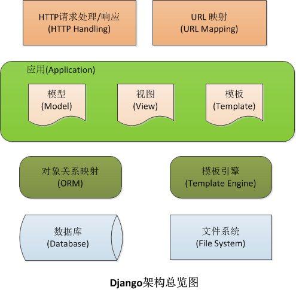

#django的大体描述
(该文章大部分借鉴[现代魔法学院](http://www.nowamagic.net/academy/part/13/286/))
django是由 堪萨斯(Kansa)州 Lawrence 城中的一个 网络开发小组编写的。 它诞生于 2003 年秋天，那时 Lawrence Journal-World 报纸的 程序员 Adrian Holovaty 和 Simon Willison 开始用 Python 来编写程序。

##MVC思想
django符合MVC(model-view-controler)思想，但是又对MVC进行了修改:

- model部分没有改变  
- 控制器改由URLconf来实现，即urls.py，使用正则表达式匹配URL，然后调用views.py中合适的函数
- view部分，改为view视图(views.py)和template模板(html和模板语言)   

即**MTV模式**,模式-模板-视图。视图方法定义了要显示模型中的哪些数据，模板决定数据的显示方式。  
(*注意：Django view仅仅决定要展示那些数据给用户，至于如何展示交给了模板template，换句话说，作为业务逻辑层，连接模板和模型的桥梁：存取模型、渲染合适的模板。*)

看如下简单例子：   
基本4个文件：(models.py , views.py , urls.py )和html模板文件 (latest_books.html )。
models.py   
```
# models.py (the database tables)

from django.db import models

class Book(models.Model):
    name = models.CharField(max_length=50)
    pub_date = models.DateField()
```
views.py   
```
# views.py (the business logic)

from django.shortcuts import render_to_response
from models import Book

def latest_books(request):
    book_list = Book.objects.order_by('-pub_date')[:10]
    return render_to_response('latest_books.html', {'book_list': book_list})
```
urls.py
```
# urls.py (the URL configuration)

from django.conf.urls.defaults import *
import views

urlpatterns = patterns('',
    (r'^latest/$', views.latest_books),
)
```
latest_books.html   
```
# latest_books.html (the template)

<html><head><title>Books</title></head>
<body>
<h1>Books</h1>
<ul>

<li>{{ book.name }}</li>

</ul>
</body></html>
```
几个文件如下：  

- models.py 用一个python的类来描述数据表，成为模型。类型名称为表名，属性对应数据字段(名称并非完全的数据表名称，一般为app名称+类名)，增删改查的操作完全通过类的方法操作，无需一条条写SQl语句
- views.py 包含页面的业务逻辑，其中latest_books()称作视图
- urls.py 指出不同的url对应相应的是视图，例子中，/latest/会调用latest_books()这个函数。比如，你的域名为redbutterfly.me，则，http://redbutterfly.me/latest/会调用latest_books()
- latest_books.html 是一个html文件，除了基本的html语言外，可以看到类似的语言，这就是模板语言。

这种松耦合的结构，非常有利于团队合作，相互之间松散结合，针对不同的功能、模块，只需修改对应的模块。

##架构

如图所示，核心在于中间件(middleware)，django所有的请求、返回等都由middleware来完成。  
中间件，就是处理HTTP的request和response的，类似插件，比如有Request中间件、view中间件、response中间件、exception中间件等，Middleware都需要在 “project/settings.py” 中 MIDDLEWARE_CLASSES 的定义。  
首先，Middleware都需要在 “project/settings.py” 中 MIDDLEWARE_CLASSES 的定义， 一个HTTP请求，将被这里指定的中间件从头到尾处理一遍，暂且称这些需要挨个处理的中间件为处理链，如果链中某个处理器处理后没有返回response，就把请求传递给下一个处理器；如果链中某个处理器返回了response，直接跳出处理链由response中间件处理后返回给客户端，可以称之为短路处理。