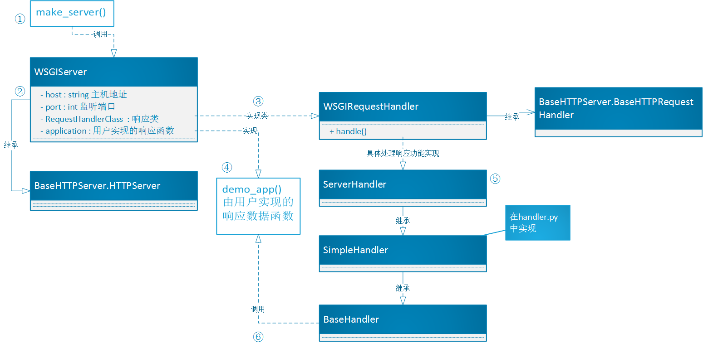

#HTTP Request   
之前简单分析过Django的目录结构，这章先简单介绍Django处理一个HTTP请求时候的处理过程，然后，从入口开始分析源码。    
##Django处理request流程   
(流程图来自于[Django运行方式及处理流程总结](http://www.kuqin.com/shuoit/20141109/343106.html))
首先，来查看大体流程图：   

1. 用户通过浏览器请求一个页面；
2. 请求到达Request Middlewares，中间件对request做一些预处理或者直接response请求；  
3. URLConf通过urls.py文件和请求的URL找到相应的View；  
4. View Middlewares被访问，它同样可以对request做一些处理或者直接返回response；  
5. 调用View中的函数；   
6. View中的方法可以选择性的通过Models访问底层的数据；   
7. 所有的Model-to-DB的交互都是通过manager完成的；  
8. 如果需要，Views可以使用一个特殊的Context；   
9. Context被传给Template用来生成页面；  

a. Template使用Filters和Tags去渲染输出；   
b. 输出被返回到View；   
c. HTTPResponse被发送到Response Middlewares；   
d. 任何Response Middlewares都可以丰富response或者返回一个完全不同的response；   
e. Response返回到浏览器，呈现给用户；   

上述流程中最主要的几个部分分别是：Middleware(中间件，包括request, view, exception, response)，URLConf(url映射关系)，Template(模板系统)；

##WSGI  
WSGI：Web Server Gateway Interface.    

一个最简单的Web应用，只需要实现以下功能：接受用户的请求，然后生成HTML信息，返回给用户；   
但是，说起来简单，内部包含了太多东西，所有请求数据信息的解析、根据请求地址和信息，获取对应的html信息、根据不同的状态发送HTTP响应等；而，像接受HTTP请求、解析HTTP请求、发送HTTP响应等这些统一的、按照HTTP协议操作的流程，这些底层代码就由专门的**服务器**来实现，然后应用接口来根据不同的url实现HTML的生成即可。    
而WSGI就是前面提到的服务器的接口规范，即一个Web组件的接口规范。包括创建服务器，获取并解析http请求，然后调用应用，根据返回值，返回响应。   

提到这个，不得不提还有几个类似的词汇：**uWSGI、uwsgi**    
(不就是换个大小写么！(╯‵□′)╯︵┻━┻!!no,no,case sensitive!换个大小写，意思可差多了)
uwsgi,是一种线路协议而不是通信协议，在此常用于在uWSGI服务器与其他网络服务器的数据通信；也就是说，这也是个协议。     
uWSGI,是一个Web服务器，它实现了WSGI协议、uwsgi、http等协议，Nginx中HttpUwsgiModule的作用是与uWSGI服务器进行交换；也就是说，uWSGI和前两者不一样，这货是个货真价实的代码，不是抽象的概念。
这样区分开了，要了解WSGI这个协议干了啥，咱们可以查看uWSGI代码来分析，那就来看看django自带的uWSGI如何实现的吧；根据网上的资料发现，django自带的服务器是基于python的wsgiref模块实现的。所以还是从命令入口开始看吧；      

##开始分析django的uWSGI   
运行django自带的服务器代码是:`manage.py runserver [IP]:[PORT]`    
这样的话，就来看看入口文件：`manage.py`:    
```
if __name__ == "__main__":
    os.environ.setdefault("DJANGO_SETTINGS_MODULE", "mysite.settings")

    from django.core.management import execute_from_command_line

    execute_from_command_line(sys.argv)

```
看到代码后，亲切感悠然而生，不错！这和django-admin.py的代码几乎一致！不同的是其载入了已经存在于项目中的配置文件setting.py，也就是之后需要配置信息的地方，都从此处获取，不用从默认配置获取了。    
既然基本一致，咱们就可以直接跳到命令执行的阶段了，所有的命令都存在于`django/core/management/commands`中。     
代码量比起创建项目要大，这里就分几个小章节吧。   

###Ⅰ.命令开始

1. runserver的命令和startproject不同的是，在fetch_command的方法导入模块的时候，runserver的模块是：`django.contrib.staticfiles.management.commands.runserver`；(此处使用staticfiles的runserver，是因为项目的配置文件中，添加了STATIC_URl的设置，所以使用支持静态文件的服务)     
2. <span id="jumpstaticfiles">静态文件支持：</span>打开staticfiles的文件runserver.py，看到类`Command`是`RunserverCommand`的子类(而这个`RunserverCommand`其实就是django.core里面runserver的类)，重载了两个方法：`add_arguments()、get_handler()`，说是重载，其实是扩展了，add_在arguments增加了两个参数，在get_handler中，也是对这两个参数进行了增加。所以，之后，我们可以继续回到core里面看我们熟悉的代码；      
4. 在从上一章可知，方法的主要调用顺序是`run_from_argv() --> execute() --> handle()`，runserver的类重载了方法`execute()`和`handle()`，但是方法execute只是多添加了一个选项no_color，就调用了父类的方法，所以可以直接看方法`handle()`；    
5. 方法`handle()`内，先检查setting的DEBUG选项，然后检查是否支持ipv6，然后检查是否提供了IP地址和端口号，有的话，直接赋值，没有的话使用默认参数，最后执行方法`run()`；

###Ⅱ.自动重载模块   
1. run方法里有分支，判断是否user_reloader，运行程序可知走的就是user_reloader分支，该分支会调用`django/utils/autoreload.py`的main函数，**先说下autoreload模块的作用：在我们运行runserver之后，使我们在修改代码后会自动服务重启。**来看看到底怎么实现的；        
2. 先来看看代码   
```
def main(main_func, args=None, kwargs=None):
    if args is None:
        args = ()
    if kwargs is None:
        kwargs = {}
    if sys.platform.startswith('java'):
        reloader = jython_reloader
    else:
        reloader = python_reloader

    wrapped_main_func = check_errors(main_func)
    reloader(wrapped_main_func, args, kwargs)
```
先判断是否java平台，咱们就用`python_reloader()`，然后用闭包为传进来的方法`inner_run()`添加错误判断功能，然后执行`reloader()`;    
重点来了，有必要贴下代码：
```
def restart_with_reloader():
    while True:
        args = [sys.executable] + ['-W%s' % o for o in sys.warnoptions] + sys.argv
        if sys.platform == "win32":
            args = ['"%s"' % arg for arg in args]
        new_environ = os.environ.copy()
        new_environ["RUN_MAIN"] = 'true'
        exit_code = os.spawnve(os.P_WAIT, sys.executable, args, new_environ)
        if exit_code != 3:
            return exit_code

def python_reloader(main_func, args, kwargs):
    if os.environ.get("RUN_MAIN") == "true":
        thread.start_new_thread(main_func, args, kwargs)
        try:
            reloader_thread()
        except KeyboardInterrupt:
            pass
    else:
        try:
            exit_code = restart_with_reloader()
            if exit_code < 0:
                os.kill(os.getpid(), -exit_code)
            else:
                sys.exit(exit_code)
        except KeyboardInterrupt:
            pass
```
在前面的步骤我添加过打印，然后用runserver测试的时候，打印必定会重复两次，原因就在这。首先，`python_reloader()`中，先判断是否有环境变量RUN_MAIN，第一次进入是不会有的。 所以，进入else分支，然后执行方法`restart_with_reloader()`，函数的循环内，获取运行的参数和环境变量，设置RUN_MAIN环境变量，然后用os.spawnve启动子进程，在此处就会再次启动`manage.py runserver [IP:PROT]`，待到再次运行到方法`python_reloader()`，就会执行第一个流程，用线程启动传进来的函数[`self.inner_run`](#jumpstartWSGI),然后，执行函数`reloader_thread()`。看下代码：
```
def reloader_thread():
    ensure_echo_on()
    if USE_INOTIFY:
        fn = inotify_code_changed
    else:
        fn = code_changed
    while RUN_RELOADER:
        change = fn()
        if change == FILE_MODIFIED:
            sys.exit(3)  # force reload
        elif change == I18N_MODIFIED:
            reset_translations()
        time.sleep(1)
```
函数`reloader_thread()`主要是，每秒调用代码修改检查函数，假如修改的话，就会退出，并返回退出码3。返回到函数`restart_with_reloader()`内，假如退出码为3的话，会继续循环，重新创建子进程...这样就实现了代码自动重载；当退出码不为3的时候，比如出错，或者咱们按了`ctrl+c`，代码就会推出循环，然后结束父进程，程序结束。这就是自动重载功能，咱们返回到正常流程。   

###Ⅲ.<span id="jumpstartWSGI">开始启动uWSGI服务器</span>
上面提到，子进程最后会执行之前传进来的函数`inner_run()`,来继续看该函数。   
1. 首先，函数会执行`autoreload.raise_last_exception()`来上报之前产生的警告等，然后例行的进行系统检查，settings等操作，同时输出日志，包括警告、时间、系统版本、启动IP端口等；   
2. 输出基本信息之后，最终执行：   
```
    handler = self.get_handler(*args, **options)
    run(self.addr, int(self.port), handler,
        ipv6=self.use_ipv6, threading=threading)
```
首先执行，get_handler()获取wsgi的应用模块(*此处需要记住，静态文件模块对该方法进行了重载扩展：[跳转](#jumpstaticfiles)*)，模块为： `django.core.servers.basehttp.py的get_internal_wsgi_application()`，主要代码如下：   
```
    app_path = getattr(settings, 'WSGI_APPLICATION')
    if app_path is None:
        return get_wsgi_application()

    try:
        return import_string(app_path)
    except .......
```
先获取咱们项目中的配置WSGI_APPLICATION，一般为`mysite.wsgi.application`(*mysite是我的测试的项目名称*)，然后通过函数`import_string()`载入对应的类，即wsgi.py中的`application = get_wsgi_application()`; 函数`get_wsgi_application()`最终返回的是，<span id="wsgihandler">`django.core.handlers.wsgi.py的WSGIHandler`</span>。 然后，执行`django.core.servers.basehttp的run()`函数，并将IP、端口、WSGIHandler的其他参数传入；   
3. 开始分析`basehttp.py的run()`函数之前，需要先要了解下python内置的uWSGI:wsgiref。因为前面介绍过，django自带的uWSGI大部分继承自wsgiref，所以要想了解django的uWSGI，就要先了解wsgiref。

###Ⅳ. 中场休息，来看看wsgiref    

#####Socket编程   
了解wsgiref之前，先要看下python最基本的socket编程：   
```
from SocketServer import TCPServer,StreamRequestHandler
#定义请求处理类
class Handler(StreamRequestHandler):
	def handle(self):
		addr = self.request.getpeername()
		print 'Got connection from ',addr
		self.wfile.write('Thank you for connecting')

server = TCPServer(('',1234), Handler)		#实例化服务类对象
server.server_forever()		#开启服务
```    
这是最简单的一个SocketServer，TCPServer创建服务，Handler用来处理接受服务之后的处理和回应；
这个最简单的模式，是接下来使用的HTTPServer和WSGIServer等等，所有服务器的样板，这就是树干，所有其他操作都是添枝加叶。

针对TCPServer模块，看起来就是传送参数，然后启动，好简单；其实内部实现也不是很复杂，TCPServer使用的socket模块，调用socket(),bind()；有C语言编程经验的同学，应该看熟悉，就是和C语言的同名函数对应的，因为本来Python就是C写的。   

#####BaseHTTPServer,SocketServer的子类   
然后，wsgiref中，直接相关的是模块：BaseHTTPServer，是基本的HTTP服务器，这个模块定义了两个实现 HTTP 服务器 (Web 服务器)的类。对应上面的样板，该模块提供了两个类：HTTPServer和BaseHTTPRequestHandler，查看源码知道，这两个类分别是TCPServer和StreamRequestHandler的子类。   
HTTPServer基本和TCPServer使用一致，BaseHTTPRequestHandler也是单独的不能响应HTTP请求，需要用子类来实现do_SPAM方法来处理不同的HTTP请求，例如通过实现do_GET()、do_POST()，来处理GET和POST请求；内部处理呢，可以通过属性path()获取路径，通过输出流wfile，来返回响应内容等；例如：   
```
class MyHandler(BaseHTTPRequestHandler):
	def do_GET(self):
		self.wfile.write('''<html><head><title>Not Found</title>
			<body>The requested document '%s' was not found.</body></head></html>''')
```
这样就可以最简单的响应GET请求了。    
<span id="requesthandler">为什么会调用do_SPAM呢？</span>看`BaseHTTPServer.py`得知，首先，服务器获取请求之后，会调用`BaseHTTPRequsetHandler的方法handle()`,之后的调用顺序是：`handle()->handle_one_request()->parse_requset()解析请求信息->检查是否存在方法do_SPAM()->do_SAPM()`。这样就很明了了，可以开始了解wsgiref了。


wsgiref的文件不多，而且，通过上面的了解，HTTPServer分为两部分，一个是接受请求的Server部分，还有就是处理请求的Handler部分，这样看看wsgiref的几个文件：    

* simple_server.py 实现了Server部分、简单的demo、以及调用Handler    
* handlers.py 具体实现了Handler的功能    
* headers.py 为HTTP协议中Header部分建立数据结构   
* util.py 一些工具函数，主要有URL的处理和环境变量   
* validate.py 一个验证工具，验证咱们实现的处理是否符合WSGI标准   

来看下下面的简单的结构图：   
     

0. 首先呢，先声明两个类：WSGIServer和WSGIRequestHandler，看两个名称就能和上面讲的基本模板一致，在此基础上看看其实现；
1. 最先调用函数make_server获取服务的句柄，看代码：    
```
def make_server(
    host, port, app, server_class=WSGIServer, handler_class=WSGIRequestHandler
):
    """Create a new WSGI server listening on `host` and `port` for `app`"""
    server = server_class((host, port), handler_class)
    server.set_app(app)
    return server
```
先默认传入`WSGIServer、WSGIRequestHandler`，然后是IP、端口以及咱们自己实现的app接口。根据这些参数，创建server实例。
2. 类WSGIServer就是继承自`BaseHTTPServer.HTTPServer`，然后只增加了三个方法，设置环境变量`setup_environ()`,设置和获取用户函数`get_app()\set_app()`；    
3. 重点：`WSGIRequestHandler`，`WSGIRequestHandler`继承自`BaseHTTPServer.BaseHTTPRequestHandler`,并且重载了方法`handler()`,根据[之前的分析](#requesthandler),接受到http请求之后，会调用`handler()`来分析、处理请求。也就是说，`WSGIRequestHandler`重新实现了处理过程。来看看实现方法：    
```
    def handle(self):

        self.raw_requestline = self.rfile.readline(65537) #通过rfile获取请求内容
        if len(self.raw_requestline) > 65536:
        	......

        if not self.parse_request(): # 调用方法parse_request解析请求内容，parse_request再其父类中实现
            return

        handler = ServerHandler(	#??
            self.rfile, self.wfile, self.get_stderr(), self.get_environ()
        )
        handler.request_handler = self      # backpointer for logging
        handler.run(self.server.get_app())
```
前面几行获取、分析请求的实现和父类的`handle_one_request()`差不多的，不同在于，分析完之后的回应处理，实例了ServerHandler，然后执行run，接下来，让我们看看`ServerHandler`；    
4. `ServerHandler`是`hander.py中的类SimpleHandler`的子类,而`SimpleHandler`是`BaseHandler`的子类，在结构图中能够看到，`SimpleHandler`主要重载了初始化函数，赋值给自己的输入输出流，在该处就是获取`BaseHTTPRequestHandler`的输入输出流，实现获取请求和输出响应。接下来看看run函数做了什么；    
5. 下面是主要代码：    
```
        try:
            self.setup_environ()
            self.result = application(self.environ, self.start_response)
            self.finish_response()
```
三件事：设置环境参数、执行用户的app函数获取响应内容、执行响应函数。设置环境参数，自己看看就行，没啥东西。而执行用户的app，这个是咱们实现的，此例中呢，就是demo_app，代码也不贴了，主要就是设置一个文件流，设置显示在浏览器的信息("Hello World！"),然后执行start_response,最后返回要信息内容。当然这并非最精简的，最精简的是啥呢：
```
def application(environ, start_response):
    start_response('200 OK', [('Content-Type', 'text/html')])
    return '<h1>Hello, web!</h1>'
```
**这是最精简的，调用start_response、返回信息，哪一步都不能少。**，至于获取url内容，根据get/post进行不同的处理等等，都是根据用户需要实现;    
6. 然后，`start_response()`做了什么呢，主要是根据PEP333协议，检查传入的状态值，和头信息是否正确，代码如下：
```
        self.status = status
        self.headers = self.headers_class(headers)
        return self.write
```
将传入的status和头信息保存下来，并返回`SimpleHandler`的方法`self.write`(*最后这个返回，在看代码的时候，大脑转不弯了，一直以为是在run函数内返回给self.result，其实是返回给用户的，可以让用户自己进行写操作的，傻！*)；   
7. 最后是`finish_response()`，上一步是保存要发送的信息，而此处是把响应信息发送出去，代码：    
```
    def finish_response(self):
        try:
            if not self.result_is_file() or not self.sendfile():
                for data in self.result:
                    self.write(data)
                self.finish_content()
        finally:
            self.close()
```
很简单，先是判断返回结果是否是文件(其实有针对发送文件的功能，但是源码的sendfile()没有实现，直接返回false，待我们来实现\\(^o^)/)，不是的话，就一段段的将响应结果发送出去，最后调用finish_content，确认所有信息发送完成。

以上就是大体流程，其他很多功能，就是错误处理或者其他功能等等。至于更深一层的实现，估计要到C语言方面了，我还没有看源码，估计应该是用libev来实现，或者是类似方式，利用select、poll或epoll，这几种IO多路复用的机制来实现的底层。基本的wsgiref清楚啦，咱们可以来看看django的uWSGI了。     
###Ⅴ.正式开始uWSGI服务    
其实呢，了解wsgiref了，django的uWSGI也已经基本了解了，基本上百分之八、九十都是wsgiref的代码。
章节Ⅲ的最后，讲到启动`basehttp.py的run()`，代码如下：
```
def run(addr, port, wsgi_handler, ipv6=False, threading=False):
    server_address = (addr, port)
    if threading:
        httpd_cls = type(str('WSGIServer'), (socketserver.ThreadingMixIn, WSGIServer), {})
    else:
        httpd_cls = WSGIServer
    httpd = httpd_cls(server_address, WSGIRequestHandler, ipv6=ipv6)
    if threading:
        httpd.daemon_threads = True
    httpd.set_app(wsgi_handler)
    httpd.serve_forever()
```
在了解了wsgiref之后，再来看看这个函数，是不是如丝般顺滑，倍感舒适。不错，还是那个样板，还是熟悉的味道。Server、Handler、set_app，这个结构就不用讲了，看看一个特别的地方即可：     
第四行的type(*python的大神肯定清楚用法，我这个菜鸟还是很久之前看元类metaclass的讲解的时候，看到这个用法，但是时间一长，又忘了！顺便推荐[元类讲解的链接](https://taizilongxu.gitbooks.io/stackoverflow-about-python/content/2/README.html)*),这是利用type来声明类的用法，可以看到在threading的分支下，继承了两个类socketserver.ThreadingMixIn, WSGIServer。WSGIServer咱们清楚，之后再说；而这个ThreadingMixIn，熟悉socketserver的人应该知道，这个类是用线程来接受请求，即针对每个请求都启动一个线程来处理。源码也是很简单，此处不再讲解。

然后就是，WSGIServer、WSGIRequestHandler的讲解。。。。但是，对不起，我又看了看basehttp.py的代码，发现和wsgiref的simple_server.py的基本雷同，没啥可讲了。

所以，之后咱们还是关注[`wsgi_handler`](#wsgihandler)，它就相当于wsgiref中的demo_app。来的请求是，如何从run函数调用到咱们项目中的view.py模块的呢？都在wsgi_handler当中。  

###Ⅵ.wsgi_handler    


