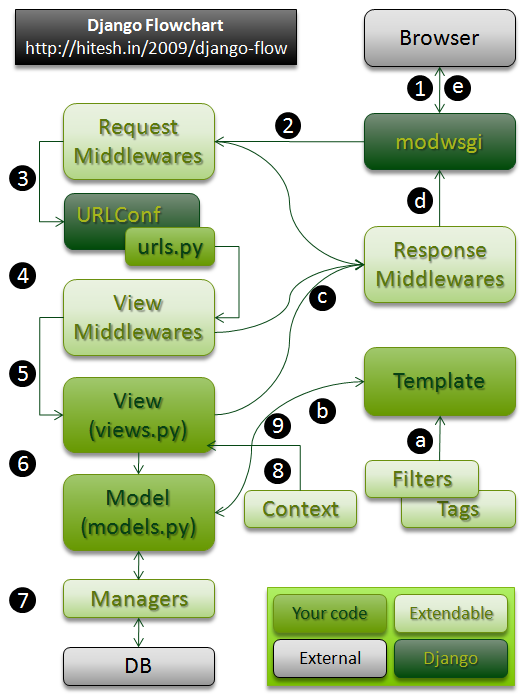

#HTTP Request   
之前简单分析过Django的目录结构，这章先简单介绍Django处理一个HTTP请求时候的处理过程，然后，从入口开始分析源码。    
##Django处理request流程   
(大部分参考自[Django运行方式及处理流程总结](http://www.kuqin.com/shuoit/20141109/343106.html))
首先，来查看大体流程图：   

1. 用户通过浏览器请求一个页面；
2. 请求到达Request Middlewares，中间件对request做一些预处理或者直接response请求；  
3. URLConf通过urls.py文件和请求的URL找到相应的View；  
4. View Middlewares被访问，它同样可以对request做一些处理或者直接返回response；  
5. 调用View中的函数；   
6. View中的方法可以选择性的通过Models访问底层的数据；   
7. 所有的Model-to-DB的交互都是通过manager完成的；  
8. 如果需要，Views可以使用一个特殊的Context；   
9. Context被传给Template用来生成页面；  

a. Template使用Filters和Tags去渲染输出；   
b. 输出被返回到View；   
c. HTTPResponse被发送到Response Middlewares；   
d. 任何Response Middlewares都可以丰富response或者返回一个完全不同的response；   
e. Response返回到浏览器，呈现给用户；   

上述流程中最主要的几个部分分别是：Middleware(中间件，包括request, view, exception, response)，URLConf(url映射关系)，Template(模板系统)；

##WSGI  
WSGI：Web Server Gateway Interface.    

一个最简单的Web应用，只需要实现以下功能：接受用户的请求，然后生成HTML信息，返回给用户；   
但是，说起来简单，内部包含了太多东西，所有请求数据信息的解析、根据请求地址和信息，获取对应的html信息、根据不同的状态发送HTTP响应等；而，像接受HTTP请求、解析HTTP请求、发送HTTP响应等这些统一的、按照HTTP协议操作的流程，这些底层代码就由专门的**服务器**来实现，然后应用接口来根据不同的url实现HTML的生成即可。    
而WSGI就是前面提到的服务器的接口规范，即一个Web组件的接口规范。包括创建服务器，获取并解析http请求，然后调用应用，根据返回值，返回响应。   

提到这个，不得不提还有几个类似的词汇：**uWSGI、uwsgi**    
(不就是换个大小写么！(╯‵□′)╯︵┻━┻,no,no,换个大小写，意思差多了)
uwsgi,是一种线路协议而不是通信协议，在此常用于在uWSGI服务器与其他网络服务器的数据通信；也就是说，这也是个协议。     
uWSGI,是一个Web服务器，它实现了WSGI协议、uwsgi、http等协议，Nginx中HttpUwsgiModule的作用是与uWSGI服务器进行交换；也就是说，uWSGI和前两者不一样，这货是个货真价实的代码，不是抽象的概念。
这样区分开了，要了解WSGI这个协议干了啥，咱们可以查看uWSGI代码来分析，那就来看看django自带的uWSGI如何实现的吧；根据网上的资料发现，django自带的服务器是基于python的wsgiref模块实现的。但是，我也没看过wsgiref的代码，所以还是直接看django的实现吧，一下学了两套代码\\(^o^)/；      

##开始分析django的uWSGI   
运行django自带的服务器代码是:`manage.py runserver [IP]:[PORT]`    
这样的话，就来看看入口文件：`manage.py`:    
```
if __name__ == "__main__":
    os.environ.setdefault("DJANGO_SETTINGS_MODULE", "mysite.settings")

    from django.core.management import execute_from_command_line

    execute_from_command_line(sys.argv)

```
看到代码后，亲切感悠然而生，不错！这和django-admin.py的代码几乎一致！不同的是其载入了已经存在于项目中的配置文件setting.py，也就是之后需要配置信息的地方，都从此处获取，不用从默认配置获取了。    
既然基本一致，咱们就可以直接跳到命令执行的阶段了，所有的命令都存在于`django/core/management/commands`中。     
代码量比起创建项目要大，这里就分几个小章节吧。   

###Ⅰ.命令开始

1. runserver的命令和startproject不同的是，在fetch_command的方法导入模块的时候，runserver的模块是：`django.contrib.staticfiles.management.commands.runserver`；(此处使用staticfiles的runserver，是因为项目的配置文件中，添加了STATIC_URl的设置，所以使用支持静态文件的服务)     
2. <span id="jumpstaticfiles">静态文件支持：</span>打开staticfiles的文件runserver.py，看到类`Command`是`RunserverCommand`的子类(而这个`RunserverCommand`其实就是django.core里面runserver的类)，重载了两个方法：`add_arguments()、get_handler()`，说是重载，其实是扩展了，add_在arguments增加了两个参数，在get_handler中，也是对这两个参数进行了增加。所以，之后，我们可以继续回到core里面看我们熟悉的代码；      
4. 在从上一章可知，方法的主要调用顺序是`run_from_argv() --> execute() --> handle()`，runserver的类重载了方法`execute()`和`handle()`，但是方法execute只是多添加了一个选项no_color，就调用了父类的方法，所以可以直接看方法`handle()`；    
5. 方法`handle()`内，先检查setting的DEBUG选项，然后检查是否支持ipv6，然后检查是否提供了IP地址和端口号，有的话，直接赋值，没有的话使用默认参数，最后执行方法`run()`；

###Ⅱ.自动重载模块   
1. run方法里有分支，判断是否user_reloader，运行程序可知走的就是user_reloader分支，该分支会调用`django/utils/autoreload.py`的main函数，**先说下autoreload模块的作用：在我们运行runserver之后，使我们在修改代码后会自动服务重启。**来看看到底怎么实现的；        
2. 先来看看代码   
```
def main(main_func, args=None, kwargs=None):
    if args is None:
        args = ()
    if kwargs is None:
        kwargs = {}
    if sys.platform.startswith('java'):
        reloader = jython_reloader
    else:
        reloader = python_reloader

    wrapped_main_func = check_errors(main_func)
    reloader(wrapped_main_func, args, kwargs)
```
先判断是否java平台，咱们就用`python_reloader()`，然后用闭包为传进来的方法`inner_run()`添加错误判断功能，然后执行`reloader()`;    
重点来了，有必要贴下代码：
```
def restart_with_reloader():
    while True:
        args = [sys.executable] + ['-W%s' % o for o in sys.warnoptions] + sys.argv
        if sys.platform == "win32":
            args = ['"%s"' % arg for arg in args]
        new_environ = os.environ.copy()
        new_environ["RUN_MAIN"] = 'true'
        exit_code = os.spawnve(os.P_WAIT, sys.executable, args, new_environ)
        if exit_code != 3:
            return exit_code

def python_reloader(main_func, args, kwargs):
    if os.environ.get("RUN_MAIN") == "true":
        thread.start_new_thread(main_func, args, kwargs)
        try:
            reloader_thread()
        except KeyboardInterrupt:
            pass
    else:
        try:
            exit_code = restart_with_reloader()
            if exit_code < 0:
                os.kill(os.getpid(), -exit_code)
            else:
                sys.exit(exit_code)
        except KeyboardInterrupt:
            pass
```
在前面的步骤我添加过打印，然后用runserver测试的时候，打印必定会重复两次，原因就在这。首先，`python_reloader()`中，先判断是否有环境变量RUN_MAIN，第一次进入是不会有的。 所以，进入else分支，然后执行方法`restart_with_reloader()`，函数的循环内，获取运行的参数和环境变量，设置RUN_MAIN环境变量，然后用os.spawnve启动子进程，在此处就会再次启动`manage.py runserver [IP:PROT]`，待到再次运行到方法`python_reloader()`，就会执行第一个流程，用线程启动传进来的函数[`self.inner_run`](#jumpstartWSGI),然后，执行函数`reloader_thread()`。看下代码：
```
def reloader_thread():
    ensure_echo_on()
    if USE_INOTIFY:
        fn = inotify_code_changed
    else:
        fn = code_changed
    while RUN_RELOADER:
        change = fn()
        if change == FILE_MODIFIED:
            sys.exit(3)  # force reload
        elif change == I18N_MODIFIED:
            reset_translations()
        time.sleep(1)
```
函数`reloader_thread()`主要是，每秒调用代码修改检查函数，假如修改的话，就会退出，并返回退出码3。返回到函数`restart_with_reloader()`内，假如退出码为3的话，会继续循环，重新创建子进程...这样就实现了代码自动重载；当退出码不为3的时候，比如出错，或者咱们按了`ctrl+c`，代码就会推出循环，然后结束父进程，程序结束。这就是自动重载功能，咱们返回到正常流程。   

###Ⅲ.<span id="jumpstartWSGI">正式启动uWSGI服务器</span>
上面提到，子进程最后会执行之前传进来的函数`inner_run()`,来继续看该函数。   
1. 首先，函数会执行`autoreload.raise_last_exception()`来上报之前产生的警告等，然后例行的进行系统检查，settings等操作，同时输出日志，包括警告、时间、系统版本、启动IP端口等；   
2. 输出基本信息之后，最终执行：   
```
    handler = self.get_handler(*args, **options)
    run(self.addr, int(self.port), handler,
        ipv6=self.use_ipv6, threading=threading)
```
首先执行，get_handler()获取wsgi的应用模块(*此处需要记住，静态文件模块对该方法进行了重载扩展：[跳转](#jumpstaticfiles)*)，模块为： `django.core.servers.basehttp.py的get_internal_wsgi_application()`，主要代码如下：   
```
    app_path = getattr(settings, 'WSGI_APPLICATION')
    if app_path is None:
        return get_wsgi_application()

    try:
        return import_string(app_path)
    except .......
```
先获取咱们项目中的配置WSGI_APPLICATION，一般为`mysite.wsgi.application`(*mysite是我的测试的项目名称*)，然后通过函数`import_string()`载入对应的类，即wsgi.py中的`application = get_wsgi_application()`; 函数`get_wsgi_application()`最终返回的是，`django.core.handlers.wsgi.py的WSGIHandler`。 然后，执行`django.core.servers.basehttp的run()`函数，并将IP、端口、WSGIHandler的其他参数传入；   
3. 
